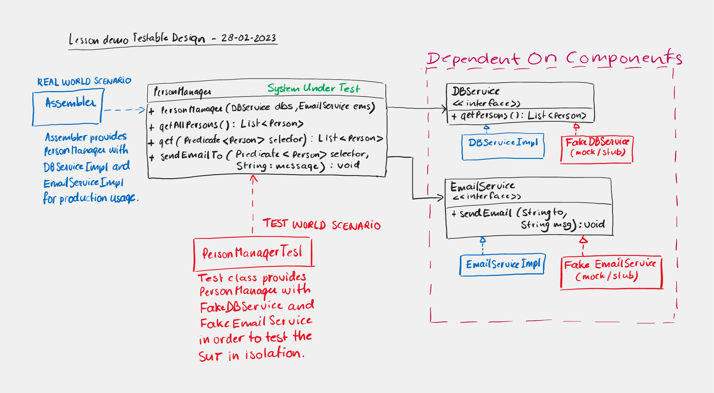

# prc2_2024_lesson_demos

This repository will house all the lesson demos used in the lessons for PRC2 in 2024.
Fontys University of Applied Science Venlo

Lesson 1 - Unit testing basics

Lesson 2 - Parameterized tests

Lesson 3 - Testable Design

Lesson 4 - Generics
